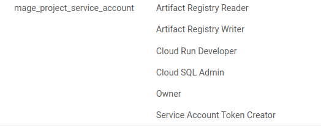

# Configuring the Mage Terraform

First download the Mage Terraform templates from GIT. You'll find Terraform templates for each cloud provider in this folder.
git clone https://github.com/mage-ai/mage-ai-terraform-templates.git

## In the GCP folder you'll find the resources you need to terraform a mage container to GCP.

REFER TO THE MAGE DOCUMENTATION FOR DEPLOYING TO GPC USING TERRAFORM - Mage-GPC SetUp

BEFORE RUNNING TERRAFORM
Make sure the following [APIs](https://console.cloud.google.com/apis/library) are enabled
* Cloud SQL Admin API
* Cloud Filestore API
* Serverless VPC Access API

Set role for service account


set up google cloud credential
```
gcloud auth application-default login
gcloud auth login
```

```
terraform init
terraform apply
```